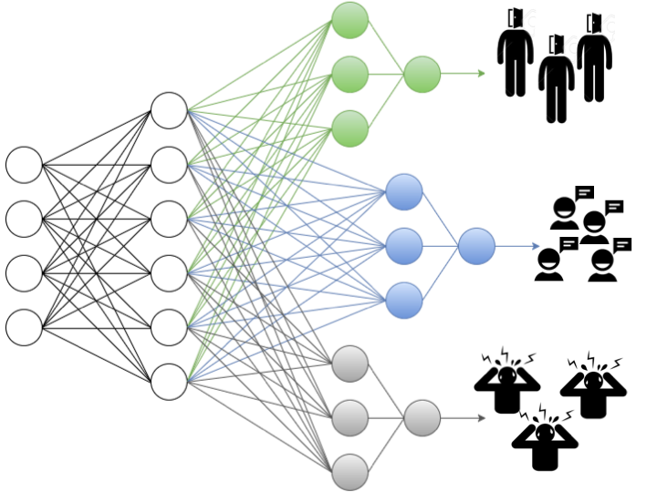

# Personalized Multitask Learning
Code for performing 3 multitask machine learning methods: deep neural networks, Multitask Multi-kernel Learning (MTMKL), and a hierarchical Bayesian model (HBLR). 

If you have any questions about this code or the associated papers, please email us at jaquesn@mit.edu or sataylor@mit.edu. 

## Please cite our work!

Taylor, S.\*, Jaques, N.\*, Nosakhare, E., Sano, A., Picard, R., <strong>"Personalized Multitask Learning for Predicting Tomorrow’s Mood, Stress, and Health"</strong>, IEEE Transactions on Affective Computing December 2017. <small>(\*equal contribution)</small> <a href="https://affect.media.mit.edu/pdfs/17.TaylorJaques-PredictingTomorrowsMoods.pdf">PDF</a>

Jaques, N.\*, Taylor S.\*, Nosakhare E., Sano A., Picard R., <strong>"Multi-task Learning for Predicting Health, Stress, and Happiness", </strong> NIPS Workshop on Machine Learning for Healthcare, December 2016, Barcelona, Spain. <small>(\*equal contribution)</small> <a href="http://affect.media.mit.edu/pdfs/16.Jaques-Taylor-et-al-PredictingHealthStressHappiness.pdf">PDF</a> <strong>*BEST PAPER AWARD*</strong> 

# Models in this code:

## Multitask Neural Network 

The intuition behind the multitask neural network design is that the shared layers will learn to extract information 
that is useful for summarizing relevant characteristics of any person’s day into an efficient, generalizable embedding. 
The final, task-specific layers are then expected to learn how to map this embedding to a prediction customized for each 
task. 

For example, if the shared layers learn to condense all of the relevant smartphone app data about phone calls and 
texting into an aggregate measure of social support, the task-specific layers can then learn a unique weighting of this 
measure for each cluster of participants. Perhaps a cluster containing participants with high extroversion scores will 
be more strongly affected by a lack of social support than another cluster.

## Multitask Multi-kernel Learning (MTMKL)

## Hierarchical Bayesian Logistic Regression (HBLR)

# Structure

## Code structure
Wrappers are used to perform a grid search over hyperparameters

## Input data format
### .csv files
Assume csvs have columns for 'user_id', 'timestamp'

### 'Task dict list' 
For the multi-task algorithms, we use a special data structure saved to a pickle file to represent the data from multiple tasks. 
The code for generating files in this format given a .csv file is available in make_datasets.py

#### File Format details
- Data for both labels-as-tasks and users-as-tasks are stored in pickled files as a list of dicts (each list item represents a task)
    - Labels-as-tasks
        - The .csv file will be partitioned such that predicting related outcomes is each task (e.g. predicting stress is one task and predicting happiness is another)
        - Normalization is done based on training data for entire group
	- Users-as-tasks:
        - The .csv file will be partioned such that predicting the outcome of each user is one task.
        - Need to specify which label to target (i.e., the label that you will be predicting)
        - Normalization is done per-person
        
- Each task is a dict containing 4 keys:
    - ‘Name’: gives the name of the task, eg. "Group_Happiness_Evening_Label" or a user ID
    - ‘X’: the data matrix. Rows are samples, columns are features. Does not contain unnecessary stuff like ‘user_id’ and ‘timestamp’, and has already been normalized and empty cells filled
    - ‘Y’: the classification labels for this task, in the same order as the rows of X
    - ‘ModalityDict’: used for MTMKL model. Maps modalities like “phys” or “location” to their start index in the feature list 

